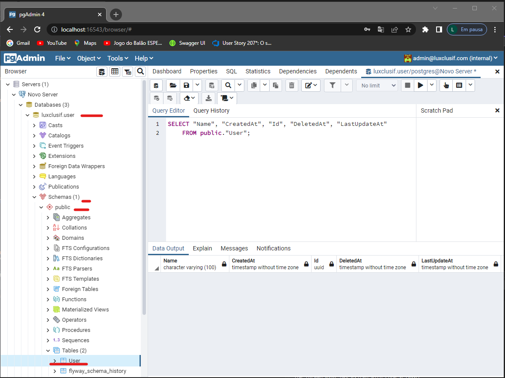

<p align="center">
  <a href="https://go.dev/doc/">
    
    </a>
</p>

# luxclusif.user

<p>User Api</p>

# Overview

This project is a microservices with a 2 workers who will receive messages and aggregate.

- An endpoint to consult the aggregations

### Prerequisites

- **[Visual Studio 2022](https://visualstudio.microsoft.com/vs/)**
- **[Docker Desktop](https://docs.docker.com/desktop/windows/install/)**
- **[Postman]()**
### Open
Once you have the pre-requirements you only will need to open the folder with Visual Studio.


# Test

With you look in your vs Code you will see a Thunder Client installed you can import the collection for testing to it or import another tool you want, place ./docs

 - Steps

1 - Check if the start is docker-compose
<p>
    
</p>
2 - Press F5 to start, after enter at http://localhost:16543/login

```
    user - admin@luxclusif.com
    password - P@ssw0rd
```
<p>
    
</p>

3 - Create new server

```
    host - luxclusif-aggregator-postgres
    user - postgres
    password - P@ssw0rd
```
<p>
    
</p>

<p>
    
</p>

 4 - Check if the table is alread created

<p>
    
</p>

5 - Enter at rabbitmq localhost:15672

```
    user - guest
    password - guest
```
<p>
    
</p>

6 - Create new exchanges
```
name - topic.createuser
type - topic
```
<p>
    
</p>
7 - Open the exchanges to validate the requests

<p>
    
</p>

8 - To access API get the port exposed, inside folder docs has json for postman

```
docker container ls
```

<p>
    
</p>

9 - Check the message of user created has hit rabbitmq

<p>
    
</p>
10 - You can check the data in database

<p>
    
</p>

11 - Inside folder docs has json for postman

<p>
    
</p>
